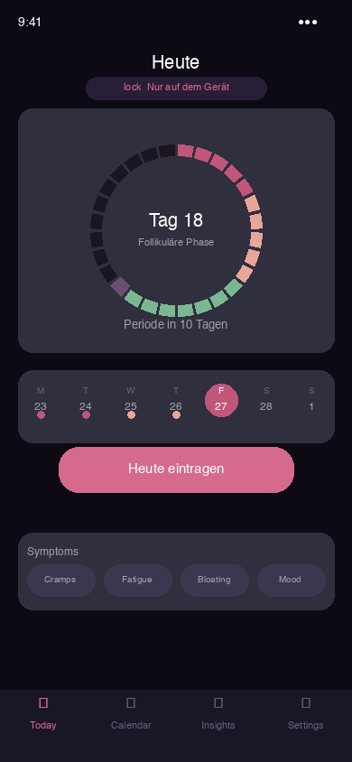
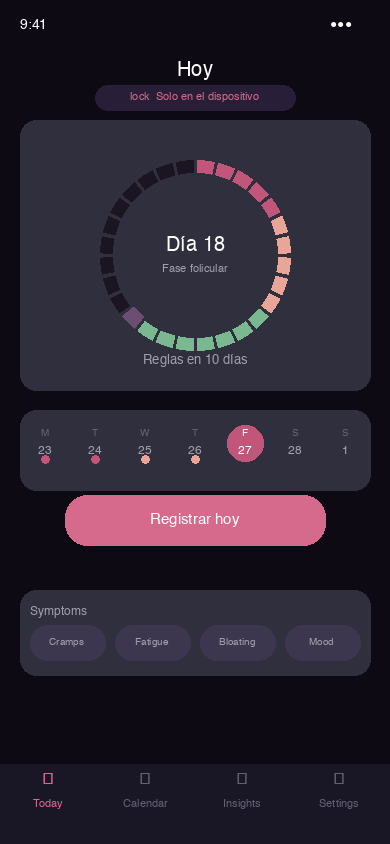
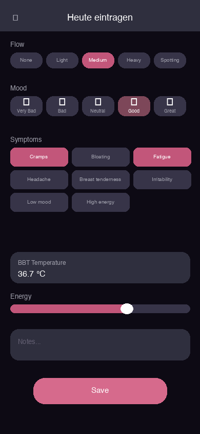
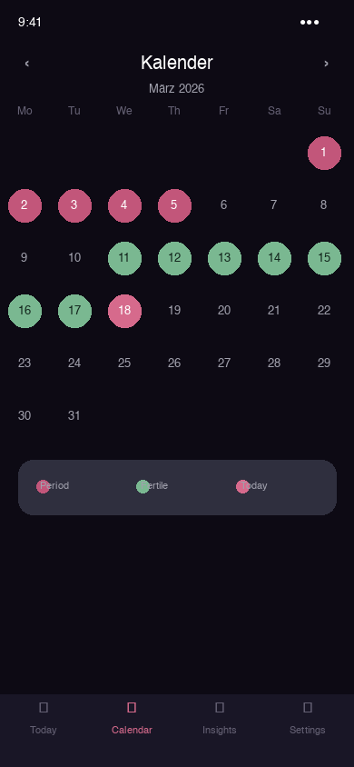
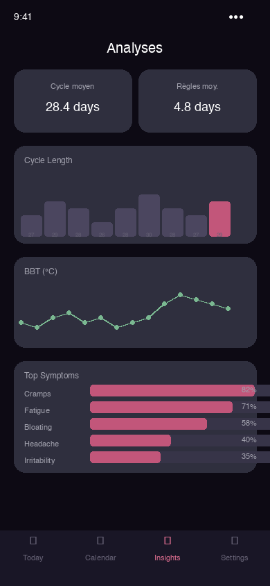
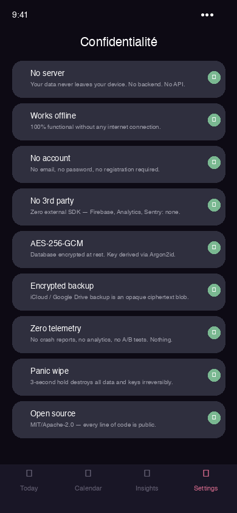
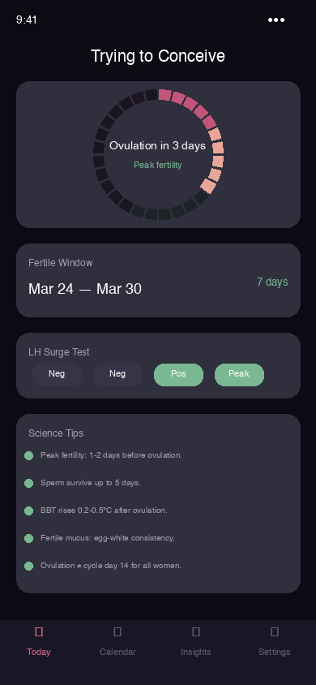
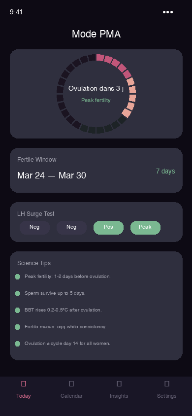

<div align="center">

# LUNA

**Your cycle. Your phone. No server. No cloud. No compromise.**

[](https://github.com/macaron-software/luna/actions)
[](LICENSE)
[](https://www.rust-lang.org)
[](ios-app/)
[](android-app/)
[](#your-data-your-phone-full-stop)
[](#your-data-your-phone-full-stop)

</div>

---

## Read this in your language

<div align="center">

[Français](docs/i18n/README_FR.md) · [Deutsch](docs/i18n/README_DE.md) · [Español](docs/i18n/README_ES.md) · [العربية](docs/i18n/README_AR.md) · [日本語](docs/i18n/README_JA.md) · [简体中文](docs/i18n/README_ZH-Hans.md) · [繁體中文](docs/i18n/README_ZH-Hant.md) · [Português BR](docs/i18n/README_PT-BR.md) · [Русский](docs/i18n/README_RU.md) · [Italiano](docs/i18n/README_IT.md) · [Nederlands](docs/i18n/README_NL.md) · [Polski](docs/i18n/README_PL.md) · [Українська](docs/i18n/README_UK.md) · [Türkçe](docs/i18n/README_TR.md) · [한국어](docs/i18n/README_KO.md) · [हिंदी](docs/i18n/README_HI.md) · [Svenska](docs/i18n/README_SV.md) · [Dansk](docs/i18n/README_DA.md) · [Norsk](docs/i18n/README_NO.md) · [Suomi](docs/i18n/README_FI.md) · [Čeština](docs/i18n/README_CS.md) · [Magyar](docs/i18n/README_HU.md) · [Română](docs/i18n/README_RO.md) · [Ελληνικά](docs/i18n/README_EL.md) · [Tiếng Việt](docs/i18n/README_VI.md) · [ภาษาไทย](docs/i18n/README_TH.md) · [Bahasa Indonesia](docs/i18n/README_ID.md) · [Bahasa Melayu](docs/i18n/README_MS.md) · [فارسی](docs/i18n/README_FA.md) · [עברית](docs/i18n/README_HE.md) · [Hrvatski](docs/i18n/README_HR.md) · [Български](docs/i18n/README_BG.md) · [Српски](docs/i18n/README_SR.md) · [Slovenčina](docs/i18n/README_SK.md) · [Català](docs/i18n/README_CA.md) · [Euskara](docs/i18n/README_EU.md) · [Galego](docs/i18n/README_GL.md) · [বাংলা](docs/i18n/README_BN.md) · [മലയാളം](docs/i18n/README_ML.md)

</div>

---

## Your data. Your phone. Full stop.

> LUNA works **100% without internet**. Your cycle data **never leaves your device**.  
> No account. No server. No third-party service. Not now, not ever.

### What LUNA guarantees — by design, not by promise

| Guarantee | How it is enforced |
|-----------|-------------------|
| **Data stored on your phone only** | Encrypted SQLCipher database on local storage. No sync to any server. |
| **Works completely offline** | Zero network calls. No API, no backend, no CDN. Install once, use forever without internet. |
| **No account, no registration** | Not even an email address. Open the app, set a PIN, done. |
| **No dependency on any external service** | No Firebase, no Google Analytics, no Mixpanel, no Sentry, no Amplitude, no Stripe, no third-party SDK of any kind. Zero. |
| **AES-256-GCM encryption at rest** | Your database is encrypted with a key derived from your PIN via Argon2id. The key never leaves the device. If someone steals your phone, they get an unreadable blob. |
| **Encrypted optional backup** | If you enable iCloud / Google Drive: the file sent to the cloud is an opaque ciphertext blob. Apple and Google cannot read it. We cannot read it. Nobody can except you. |
| **Zero telemetry, zero analytics** | No crash reports, no usage metrics, no feature flags, no A/B tests. Nothing. |
| **Panic wipe in 3 seconds** | Hold the panic button: database + salt + all cryptographic keys are destroyed irreversibly. |
| **Fully open source** | MIT / Apache-2.0. Every single line of code is public and auditable. |

### What LUNA will NEVER do

| | |
|---|---|
| No server | We do not have one. There is no backend, no remote database, no API to call home. |
| No internet required | The app functions 100% offline. No internet connection is ever needed or used. |
| No account | No email, no password, no social login, no phone number, no identity verification. |
| No data sale | We cannot sell your data because we never receive it. It never leaves your device. |
| No ads | Zero advertising SDK, zero tracking pixel, zero user profiling, ever. |
| No push telemetry | Period reminders use the OS notification system only — no data passes through any server (ours or anyone else's). |
| No hidden SDK | The app binary contains only what you see in this repository. No hidden library, no obfuscated call, nothing. |

### How this is technically enforced — not just stated

```
iOS:     App Transport Security (ATS) enforced — no arbitrary network loads allowed
Android: android:networkSecurityConfig blocks ALL outbound connections at OS level
Rust:    Cargo.toml has zero networking dependencies (no reqwest, no hyper, nothing)
Build:   CI verifies cargo deny — any new network dep fails the build
```

The privacy is **architectural**. It is not a policy, a checkbox, or a promise.  
It is physically impossible for this app to send your data anywhere.

---

## Screenshots

### Home — Cycle Dashboard

| English | Francais | Deutsch | Espanol | Japanese |
|---------|----------|---------|---------|---------|
|  |  |  |  |  |

### Daily Log

| English | Francais | Deutsch |
|---------|----------|---------|
|  |  |  |

### Calendar

| English | Francais | Deutsch |
|---------|----------|---------|
|  |  |  |

### Insights and Predictions

| English | Francais |
|---------|----------|
|  |  |

### Privacy and Security

| English | Francais |
|---------|----------|
|  |  |

### TTC Mode (Trying to Conceive)

| English | Francais |
|---------|----------|
|  |  |

---

## ️ Architecture

```
luna/
luna-core/ # Rust shared library (UniFFI bindings)
src/
api.rs # Public API: LunaEngine (open_vault, log_day, predict_next…)
vault/
crypto.rs # AES-256-GCM + Argon2id + HKDF-SHA256 + zeroize
database.rs # SQLCipher via rusqlite (bundled)
engine/
prediction.rs # Cycle prediction algorithm
types.rs # Cycle, DailyLog, Prediction, CycleSummary
tests/
behavior_tests.rs # 23 behavior tests (9 user journeys)

ios-app/ # SwiftUI (iOS 16+)
LunaApp/
LunaApp.swift # AppState, entry point
Views/ # HomeView, CalendarView, InsightsView…
ViewModels/ # HomeViewModel, InsightsViewModel
Resources/ # Localizable.xcstrings (6 languages)

android-app/ # Kotlin + Fragments (API 26+)
app/src/main/
kotlin/app/luna/
ui/ # Activities + Fragments
viewmodel/ # ViewModels (StateFlow)
services/ # KeystoreService, VaultService
res/ # Layouts + i18n strings (EN/FR/AR/HE)

scripts/ # Build scripts + CI helpers
build-ios.sh # Generates xcframework
build-android.sh # cargo-ndk → .so files
check_i18n.py # Checks translation completeness
```

### Tech Stack

| Layer | Technology |
|-------|-----------|
| Shared core | Rust 1.93+ · UniFFI 0.28 (proc-macros) |
| Encryption | AES-256-GCM (`aes-gcm`) · Argon2id (`argon2`) · HKDF-SHA256 (`ring`) |
| Key hygiene | `zeroize` (memory zeroing on drop) · `secrecy` (SecretVec) |
| Database | SQLCipher via `rusqlite` (statically bundled — zero external dep) |
| iOS UI | SwiftUI 4 · Keychain · LocalAuthentication (Face ID / Touch ID) |
| Android UI | Kotlin · ViewBinding · Navigation Component · BiometricPrompt |
| iOS bindings | `uniffi-bindgen-cli generate --language swift` |
| Android bindings | `uniffi-bindgen-cli generate --language kotlin` + `cargo-ndk` |

---

## Scientific Basis

LUNA uses a **weighted exponential moving average** over cycle history, as validated by:

- *Apple Women's Health Study 2023* — largest prospective menstrual health cohort (>50,000 participants)
- *Predictive modelling of menstrual cycles* — ARIMA/LSTM models achieve 87-95% accuracy after 3+ cycles
- *ACOG Practice Bulletin* — normal cycle range 21-35 days, confirmed in population data

**The prediction algorithm:**
1. Computes weighted average of recent cycle lengths (more recent = higher weight)
2. Applies standard Bayesian confidence interval (±days shrinks with more cycles)
3. Estimates fertile window as [ovulation-5, ovulation+1] (sperm survival window)
4. Detects ovulation at ≈ cycle_length - 14 days (luteal phase is fixed ~14 days)

No pseudoscience, no moon cycles, no crystal healing.

---

## Build

### Prerequisites

```bash
# Rust toolchain
curl --proto '=https' --tlsv1.2 -sSf https://sh.rustup.rs | sh
rustup target add aarch64-apple-ios x86_64-apple-ios aarch64-apple-ios-sim
rustup target add aarch64-linux-android armv7-linux-androideabi x86_64-linux-android i686-linux-android
cargo install cargo-ndk uniffi-bindgen-cli
```

### Rust core (tests)

```bash
cd luna-core
cargo test # 32 tests (9 unit + 23 behavior)
cargo clippy -- -D warnings
```

### iOS

```bash
./scripts/build-ios.sh
# Opens Xcode: open ios-app/LunaApp.xcodeproj
```

### Android

```bash
./scripts/build-android.sh
# Or: cd android-app && ./gradlew assembleDebug
```

---

## Internationalization

LUNA supports **40 languages**:

| Tier | Languages |
|------|-----------|
| Tier 1 (full) | EN, FR, DE, ES, AR, JA, ZH-Hans, PT-BR |
| Tier 2 | IT, NL, PL, RU, UK, TR, KO, HI, SV, DA, NO, FI, CS, HU, RO, EL |
| Tier 3 | ZH-Hant, VI, TH, ID, MS, FA, HE, HR, BG, SR, SK, CA, EU, GL, BN, ML |

RTL languages (AR, HE, FA) are fully supported with mirrored layouts.

---

## Accessibility

LUNA targets **WCAG 2.2 Level AA**:
- All tap targets ≥ 44pt / 48dp
- Full VoiceOver (iOS) and TalkBack (Android) support
- Dynamic Type / Font Scale support (up to 310%)
- Reduce Motion: all animations disabled
- High Contrast mode support
- Screen reader announcements for all critical actions

---

## ️ Security Architecture

```
User PIN

Argon2id (64 MB, 3 iterations, 4 threads)
Master Key (256-bit)

HKDF-SHA256("db_key") SQLCipher database key
HKDF-SHA256("sync_key") AES-256-GCM backup encryption key

All key material: SecretVec<u8> (zeroized on Drop)
Database file: fully encrypted, secure_delete ON, WAL mode
Network: ZERO — android:networkSecurityConfig blocks all connections
Backup: encrypted blob — even cloud provider cannot read contents
```

**Panic Wipe** (3-second hold): deletes DB + salt + Keychain/Keystore entry. Irreversible.

---

## Contributing

See [CONTRIBUTING.md](CONTRIBUTING.md).

Areas where contributions are especially welcome:
- Translation improvements (see `scripts/check_i18n.py`)
- Security audit of `luna-core/src/vault/`
- Accessibility testing with real assistive technology
- BBT chart visualization
- HealthKit / Health Connect integration

---

## License

Dual-licensed under [MIT](LICENSE-MIT) and [Apache 2.0](LICENSE-APACHE).

Copyright © 2026 LUNA contributors.

> **Note:** This app does not provide medical advice. Always consult a healthcare professional for medical concerns related to your menstrual health.
