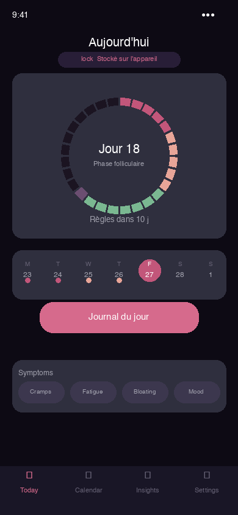
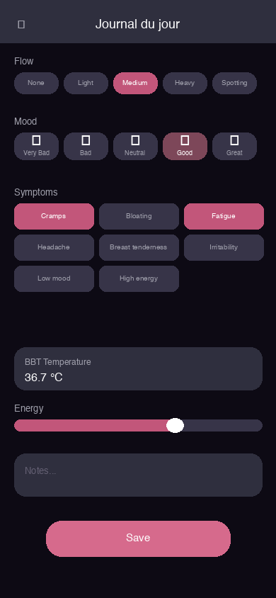
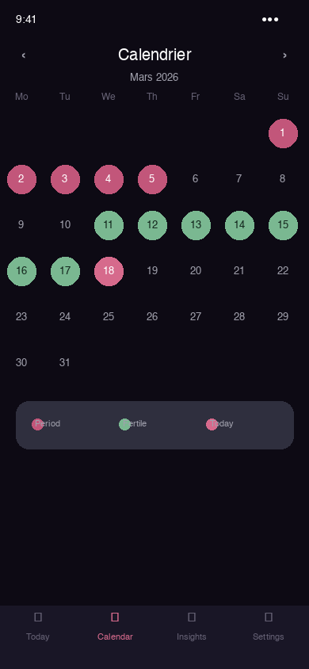

<div align="center">

# LUNA — Français

**Votre cycle. Votre téléphone. Aucun serveur. Aucun cloud. Zéro compromis.**

[](#)
[](#)
[](../../README.md)

</div>

[← English (full docs)](../../README.md)

---

## La promesse de confidentialité

| | |
|---|---|
| 📵 | **Aucun serveur.** Nous n'en avons pas. Pas de backend, pas de base de données distante, aucun point d'API auquel l'application se connecte. |
| 📶 | **Fonctionne 100 % hors ligne.** Aucune connexion internet n'est jamais requise ou utilisée. Installez une fois, utilisez à vie sans réseau. |
| 🚷 | **Aucun compte, aucune inscription.** Pas d'e-mail, pas de mot de passe, pas de connexion sociale, pas de vérification d'identité. Rien. |
| 🧩 | **Aucune dépendance à un service tiers.** Pas de Firebase, pas de Google Analytics, pas de Mixpanel, pas de Sentry, pas d'Amplitude. Zéro SDK externe. |
| 🔐 | **Données chiffrées sur votre téléphone uniquement.** Base SQLCipher chiffrée AES-256-GCM. Clé dérivée de votre PIN via Argon2id. La clé ne quitte jamais l'appareil. |
| ☁️ | **Sauvegarde cloud optionnelle — entièrement chiffrée.** iCloud/Google Drive reçoit un blob chiffré opaque. Même Apple et Google ne peuvent pas le lire. |
| 🚫 | **Zéro télémétrie, zéro analytique.** Aucun rapport de crash, aucune métrique d'usage, aucun flag de fonctionnalité, aucun A/B test. Rien ne quitte votre téléphone. |
| 💥 | **Effacement panique en 3 secondes.** Maintenez le bouton : base de données + sel + toutes les clés cryptographiques sont détruites de manière irréversible. |
| 🔓 | **100 % open source.** MIT/Apache-2.0. Chaque ligne de code est publique et auditable par quiconque. |

---

## Ce que LUNA ne fera JAMAIS

| | |
|---|---|
| **Aucun serveur** | Nous n'en avons pas. Impossible d'envoyer vos données quelque part. |
| **Aucun internet requis** | L'application fonctionne 100 % hors ligne. Toujours. |
| **Aucun compte** | Pas d'email, pas de mot de passe, pas de connexion. |
| **Aucune vente de données** | Impossible — nous ne les recevons jamais. |
| **Aucune pub** | Zéro SDK publicitaire, zéro pixel de tracking. |
| **Aucune télémétrie push** | Les rappels utilisent uniquement le système OS — aucune donnée ne transite par un serveur. |
| **Aucun SDK caché** | Le binaire ne contient que ce que vous voyez dans ce dépôt. |

```
iOS:     ATS enforced — no arbitrary network loads
Android: networkSecurityConfig blocks ALL outbound connections
Rust:    Cargo.toml has zero networking dependencies
```

---

## Screenshots

| Home | Log | Calendar | Insights | Security |
|------|-----|----------|----------|---------|
|  |  |  |  |  |

---

## Architecture

```
Noyau Rust partagé (UniFFI) · SwiftUI iOS · Kotlin Android · SQLCipher chiffré · zéro réseau
```

---

## License

MIT / Apache-2.0 — [LICENSE](../../README.md)

> ⚠️ Cette application ne fournit pas de conseil médical.
