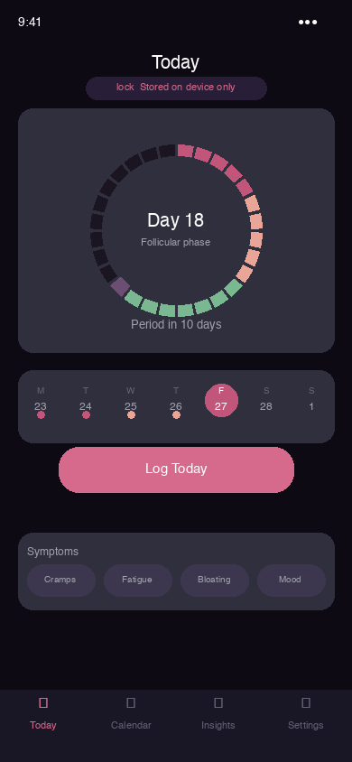
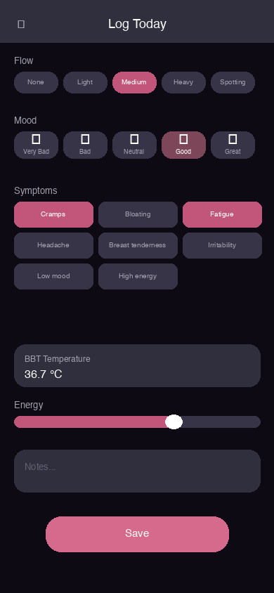
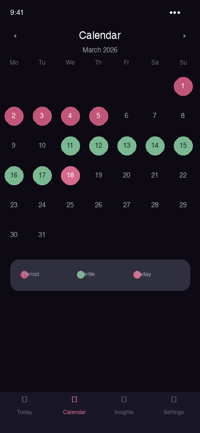
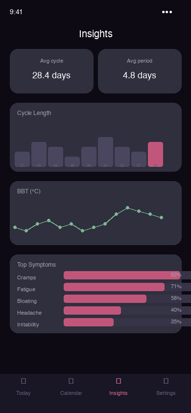
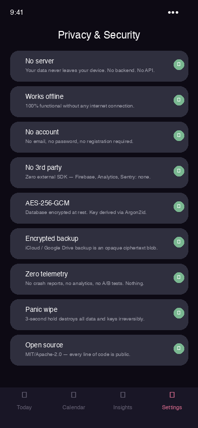

<div align="center">

# LUNA — हिंदी

**आपका चक्र। आपका फ़ोन। कोई सर्वर नहीं। कोई क्लाउड नहीं। शून्य समझौता।**

[](#)
[](#)
[](../../README.md)

</div>

[← English (full docs)](../../README.md)

---

## गोपनीयता प्रतिज्ञा

| | |
|---|---|
| 📵 | **कोई सर्वर नहीं।** हमारे पास कोई नहीं है। कोई बैकएंड नहीं, कोई रिमोट डेटाबेस नहीं, कोई API एंडपॉइंट नहीं जिससे ऐप कनेक्ट हो। |
| 📶 | **100% ऑफ़लाइन काम करता है।** इंटरनेट कनेक्शन कभी ज़रूरी नहीं होता और न ही उपयोग होता है। एक बार इंस्टॉल करें, नेटवर्क के बिना हमेशा के लिए उपयोग करें। |
| 🚷 | **कोई खाता नहीं, कोई पंजीकरण नहीं।** कोई ईमेल नहीं, कोई पासवर्ड नहीं, कोई सोशल लॉगिन नहीं, कोई पहचान सत्यापन नहीं। कुछ भी नहीं। |
| 🧩 | **किसी तृतीय पक्ष सेवा पर निर्भरता नहीं।** कोई Firebase, Google Analytics, Mixpanel, Sentry, Amplitude नहीं। शून्य बाहरी SDK। |
| 🔐 | **डेटा केवल आपके फ़ोन पर एन्क्रिप्टेड।** AES-256-GCM एन्क्रिप्टेड SQLCipher डेटाबेस। Argon2id के माध्यम से PIN से व्युत्पन्न कुंजी। कुंजी कभी डिवाइस नहीं छोड़ती। |
| ☁️ | **वैकल्पिक क्लाउड बैकअप — पूरी तरह एन्क्रिप्टेड।** iCloud/Google Drive को एक अपारदर्शी एन्क्रिप्टेड ब्लॉब मिलता है। Apple और Google भी इसे नहीं पढ़ सकते। |
| 🚫 | **शून्य टेलीमेट्री, शून्य एनालिटिक्स।** कोई क्रैश रिपोर्ट नहीं, कोई उपयोग मेट्रिक्स नहीं, कोई A/B परीक्षण नहीं। कुछ भी आपके फ़ोन को नहीं छोड़ता। |
| 💥 | **3 सेकंड में पैनिक वाइप।** बटन दबाए रखें: डेटाबेस + नमक + सभी क्रिप्टोग्राफ़िक कुंजियाँ अपरिवर्तनीय रूप से नष्ट हो जाती हैं। |
| 🔓 | **100% ओपन सोर्स।** MIT/Apache-2.0। हर कोड लाइन सार्वजनिक है और किसी के द्वारा भी ऑडिट करने योग्य है। |

---

## LUNA कभी क्या नहीं करेगा

| | |
|---|---|
| **कोई सर्वर नहीं** | हमारे पास नहीं है। आपका डेटा कहीं भेजना असंभव है। |
| **इंटरनेट की ज़रूरत नहीं** | ऐप 100% ऑफ़लाइन काम करता है। हमेशा। |
| **कोई खाता नहीं** | कोई ईमेल नहीं, कोई पासवर्ड नहीं, कोई लॉगिन नहीं। |
| **डेटा की बिक्री नहीं** | असंभव — हम इसे कभी प्राप्त नहीं करते। |
| **कोई विज्ञापन नहीं** | शून्य विज्ञापन SDK, शून्य ट्रैकिंग पिक्सेल। |
| **पुश टेलीमेट्री नहीं** | रिमाइंडर केवल OS सिस्टम का उपयोग करते हैं — सर्वर के माध्यम से कोई डेटा नहीं। |
| **कोई छिपा SDK नहीं** | बाइनरी में केवल वही है जो आप इस रिपॉजिटरी में देखते हैं। |

```
iOS:     ATS enforced — no arbitrary network loads
Android: networkSecurityConfig blocks ALL outbound connections
Rust:    Cargo.toml has zero networking dependencies
```

---

## Screenshots

| Home | Log | Calendar | Insights | Security |
|------|-----|----------|----------|---------|
|  |  |  |  |  |

---

## वास्तुकला

```
साझा Rust कोर (UniFFI) · SwiftUI iOS · Kotlin Android · SQLCipher एन्क्रिप्टेड · शून्य नेटवर्क
```

---

## License

MIT / Apache-2.0 — [LICENSE](../../README.md)

> ⚠️ यह ऐप चिकित्सा सलाह प्रदान नहीं करता है।
