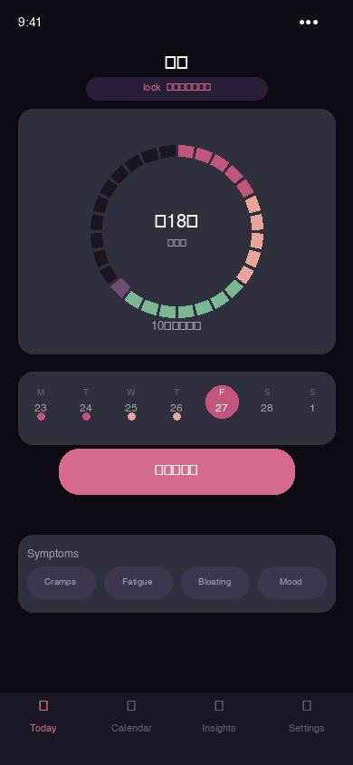

<div align="center">

# LUNA — 日本語

**あなたのサイクル。あなたの電話。サーバーなし。クラウドなし。妥協なし。**

[](#)
[](#)
[](../../README.md)

</div>

[← English (full docs)](../../README.md)

---

## プライバシーの誓約

| | |
|---|---|
| 📵 | **サーバーなし。** 私たちはサーバーを持っていません。バックエンドなし、リモートデータベースなし、アプリが接続するAPIエンドポイントなし。 |
| 📶 | **100% オフラインで動作。** インターネット接続は一切不要で使用もされません。一度インストールすれば、ネットワークなしで永遠に使えます。 |
| 🚷 | **アカウント不要、登録不要。** メールアドレス不要、パスワード不要、ソーシャルログイン不要、本人確認不要。何も不要。 |
| 🧩 | **サードパーティサービスへの依存なし。** Firebase、Google Analytics、Mixpanel、Sentry、Amplitudeは一切使用しません。外部SDKはゼロ。 |
| 🔐 | **データはあなたの電話にのみ暗号化保存。** AES-256-GCMで暗号化されたSQLCipherデータベース。Argon2idでPINから派生したキー。キーはデバイスから外に出ません。 |
| ☁️ | **オプションのクラウドバックアップ — 完全暗号化。** iCloud/Google Driveには不透明な暗号化ブロブが送られます。AppleもGoogleも読めません。 |
| 🚫 | **テレメトリーゼロ、分析ゼロ。** クラッシュレポートなし、使用統計なし、A/Bテストなし。何もあなたの電話を離れません。 |
| 💥 | **3秒でパニックワイプ。** ボタンを長押し：データベース + ソルト + すべての暗号鍵が不可逆的に破壊されます。 |
| 🔓 | **100% オープンソース。** MIT/Apache-2.0。すべてのコード行が公開されており、誰でも監査できます。 |

---

## LUNAが絶対にしないこと

| | |
|---|---|
| **サーバーなし** | 私たちはサーバーを持っていません。データを送る場所がありません。 |
| **インターネット不要** | アプリは100% オフラインで動作します。常に。 |
| **アカウントなし** | メールなし、パスワードなし、ログインなし。 |
| **データ売却なし** | 不可能 — 私たちはデータを受け取りません。 |
| **広告なし** | 広告SDKゼロ、トラッキングピクセルゼロ。 |
| **Pushテレメトリーなし** | リマインダーはOSシステムのみ使用 — サーバー経由のデータなし。 |
| **隠しSDKなし** | バイナリにはこのリポジトリで見るものだけが含まれています。 |

```
iOS:     ATS enforced — no arbitrary network loads
Android: networkSecurityConfig blocks ALL outbound connections
Rust:    Cargo.toml has zero networking dependencies
```

---

## Screenshots

| Home | Log | Calendar | Insights | Security |
|------|-----|----------|----------|---------|
|  |  |  |  |  |

---

## アーキテクチャ

```
共有Rustコア (UniFFI) · SwiftUI iOS · Kotlin Android · SQLCipher暗号化 · ゼロネットワーク
```

---

## License

MIT / Apache-2.0 — [LICENSE](../../README.md)

> ⚠️ このアプリは医療アドバイスを提供しません。
